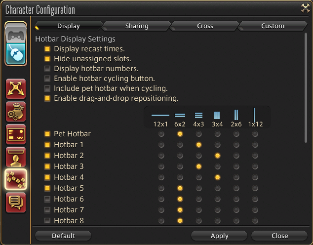
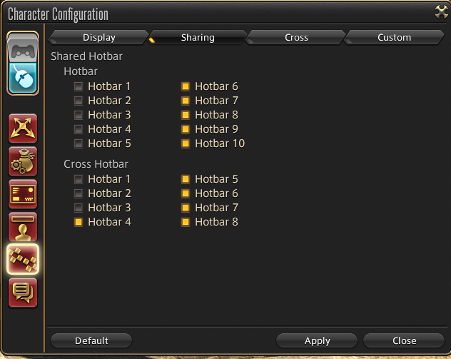
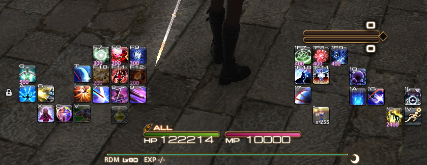

Hotbars are a deeply personal thing. The optimal setup will vary depending on a host of factors like hand size, whether your vision has blind spots, arthritis, whether you have an MMO mouse, controller usage, WASD v ESDF, etc. As a result, I can really only give some general tips on this page about what I prioritize when setting up my own hotbars.

If any of my advice on this page makes gameplay less comfortable for you, I ask only that you give it a fair shot. But if it doesn't work for you, then it doesn't work for you. All of these settings are about comfort and consistency, so just keep those goals in mind and you'll be fine.

**Basic Tips**:
* **High Use? Make it Easy To Reach** - The more you use a button, the easier it should be to press that button. 
* **Same Actions, Same Slots** - When you have multiple jobs, it becomes extremely important to keep the same or similar actions on the same keybinds. This helps muscle memory tremendously and makes it so much easier to swap between jobs smoothly. For example, all tanks should have provoke, shirk, their 30% CD, their invuln, rampart, etc on the same buttons.
* **Finger Alternation** - If two buttons are frequently hit back to back, less than a second apart, it's best to have them on separate fingers/hands so that you can start moving your hands for the second press while you're still finishing the first one.
* **Movement and Filler** - When possible, you should have buttons you need to hit while moving be somewhere you can easily hit them while moving. It sounds obvious when I write it that way, but it's easy to overlook and find yourself unable to sidestep and hit an attack at the same time.
* **Create Patterns** - As an example, on my RDM hotbars (image in Examples on this page) I have my white mana builders on the left side, and my right mana builders on the right, with neutral builders in between. Visual symmetry makes things easier to remember when first learning.

Unfortunately, I have no experience with controller play, so I cannot offer any controller-specific advice.

### Important Hotbar Settings and Quirks

**Basic Settings**

This image shows the basic settings.
* Display recast times. - If enabled, shows a number in the bottom left corner for cooldowns that indicates how long until you can use it again. **Highly Recommended** that this is turned on!
* Hide Unassigned Slots - Hides the empty gray box on a hotbar slot that has no ability slotted into it. I prefer it off, but go with what works for you.
* Display Hotbar Numbers - Shows the hotbar's ID to its left side. For example, your first hotbar will show a 1 to the left side if this is enabled. I turn it off.
* Enable hotbar cycling button - Shows up and down arrows next to hotbar 1 that let you change that hotbar to show the contents of other hotbars. Not recommended as it creates statefulness in your hotbars (i.e. one more thing to remember) and you can cycle them on accident.
* Include pet hotbar when cycling - Connected to the above. If enabled you can cycle it so that hotbar 1 shows your pet actions. Irrelevant to me since I would never use hotbar cycling.
* Enabled drag-and-drop repositioning. - When enabled, you can click on the hotbar's displayed number to drag it around. Since I don't show numbers this setting has no effect, but if you do show numbers I recommend that this is left off. Accidentally dragging your hotbar into a weird spot on the screen mid fight would be a disaster.

Below that are some per hotbar settings that are pretty straightforward. The checkbox next to each hotbar is whether or not to show that hotbar (PURELY VISUAL, keybinds will still function). The radio buttons to the right of that are the shape you want that hotbar to take. Pretty self-explanatory. I recommend using a shape that matches most closely with whatever physical layout the keys have, when possible. For example, my MMO mouse has 4 rows of buttons, in 3 columns. So I use 3x4 to match that shape. 

**Shared Hotbars**

A simple screen. Any hotbar with the checkbox active will be shared between jobs. That means that all jobs will have the same stuff on those buttons. If it's unchecked, then that hotbar will have different contents for every job and class. I forget the default here, but I think normally only hotbar 1 and 2 are unchecked. Most players will want more than that unchecked by the time they reach max level. I use 4 job-specific hotbars that are keybound, then a 5th one is just misc buttons for that job that I don't want/need keybound (like fist switching on monk, or changing pets on summoner/scholar).

**Quirks**:

* Hotbar 1 is always the one replaced by special actions when mounted or in certain duties. And you can't change that, nor can you change which buttons go where. So try to make your first few hotbar 1 binds particularly easy to reach so it's not awkward when the game makes you RP play as an NPC or something.
* Hotbar 1 is the hotbar with the lock/unlock button. As far as I know, you cannot move this lock to another hotbar, and hiding hotbar 1 hides the lock symbol.
* Even if you disable a hotbar in settings, it is still functional! Not a particularly useful trait, but one to be aware of.

### I'm Out Of Keybind Space! (Keyboard+Mouse)

There are a lot of things you can do to handle this situation:
* **Use Letter Keys** - If you aren't already, start using the letter keys near your keyboard hand for hotbar buttons.
* **Remove/Move Low Priority Binds** - When possible, move keybinds for things like menu screens away from your hands and towards somewhere harder to reach, or even unbind them entirely. This opens up a button near your hand to be used for hotbar keybinds.
* **Strafe or Turn, Pick One** - Similar to the above, this about freeing up more buttons near your hands. You do not need both strafe and turn. Pick one (I recommend strafe) and remove the other to free up keys. With default controls I believe turn _becomes_ strafe when using the mouse to move the camera, so that is also acceptable. 
* **Modifier Keys** - Shift, Control, and Alt can be used as modifier keys in any combination so that you can make the same button (e.g. E) be bound to several different things (e.g. Shift+E, Alt+E, Shift+Alt+E, could all be different things). However, be careful with this; it's easy to set yourself up with very awkward to hit combinations when using multiple abilities in a row.
* **ESDF for Movement** - Swapping from WASD to ESDF for movement puts your hand in range of slightly more buttons, and puts the A key in prime position to be your keybind for a spammable oGCD, such as Continuation or Edge of Shadow. Using ESDF for movement takes some getting used to, however, so treat it more as a last resort.
* **MMO Mouse** - An MMO mouse (which has 12 buttons on the side for your thumb to hit) is extremely helpful. It allows you to split the button load between your hands, while also giving you dramatically more buttons you can easily reach. Not required, but highly recommended.

### Pitfalls

Some common mistakes people make:
* **Keybinding Limit Break** - Just in case you're doing this, avoid keybinding limit break. For safety it's best to simply click limit break using a hotbar that's shared between jobs, so that you don't accidentally fat-finger it at a bad time. Having it be a shared hotbar.
* **Awkward Modifier Sequences** - It's easy to accidentally set up keybinds such that you have to hit something like Shift+E then Alt+W back to back. This means two fingers have to move for both actions, making it a slow combo. 
* **Binding Modifier+(Movement Button)** - If a key, such as W, is bound to an action _and_ a modified bind exists (e.g. Shift+W) then having that modifier pressed prevents the unmodified version from activating! If you bind the Shift version of your movement keys to something, you may find you cannot move when using shift to reach other abilities. That's a huge problem! So don't bind your movement keys in a modified version anywhere. No shifts, alts, or controls.
* **Changing Binds Near Raid Day** - Avoid massive changes to your keybinds close to a raid day. This may mean waiting a few weeks to be done with a raid tier. Minor changes don't usually cause problems. If you learn quick and your team has 3-4 days between raid nights you might be able to pull off bigger changes with only some loss, but give yourself time to practice the change!
* **Stateful Hotbars** - Some folks like to get fancy and have macros that swap out hotbar contents with other abilities, then swap back when hit again, or other such clever tricks. Sadly, this cleverness will get the best of you, because now your hotbars have state. This means you have added another thing to remember mid-fight, and if you forget then you start hitting the wrong buttons. Avoid this at all costs, as the more difficult the content is the more likely you are to make such a mistake, so it causes problems when it hurts the most.
* **Using Add-Ons** - Avoid using any form of add-ons for your hotbars or keybinds, most especially if you plan to day 1 raid. In addition to being against ToS and ultimately unnecessary, such add-ons invariably break for a minimum of 12 hours or so on patch day, making it difficult to rely on them for early raiders. There have been instances of them being broken for up to a week.

### Example
As a quick example, here is my hotbar setup for Red Mage:

I use ESDF for movement.

Hotbars 2 and 3 are for my MMO mouse. F7-F12 are MMO mouse buttons, as are 7-12. The hotbar is shaped like my mouse buttons are arranged. Hotbars 1 and 4 are also shaped similarly to the keyboard, though the middle row is a bit funky since \[ and \] are bound to other mouse buttons.

My AoE abilities are all on Shift modifiers, while my single target ones are all without Shift modifier. Since my aoe area had more room, I put some cooldowns used in both situations on that side as the upper buttons on my MMO mouse are easier to hit than the lower ones.

My Reprise is on a poor button (T) because it's hard to hit during movement, but at this point I've gotten used to it.