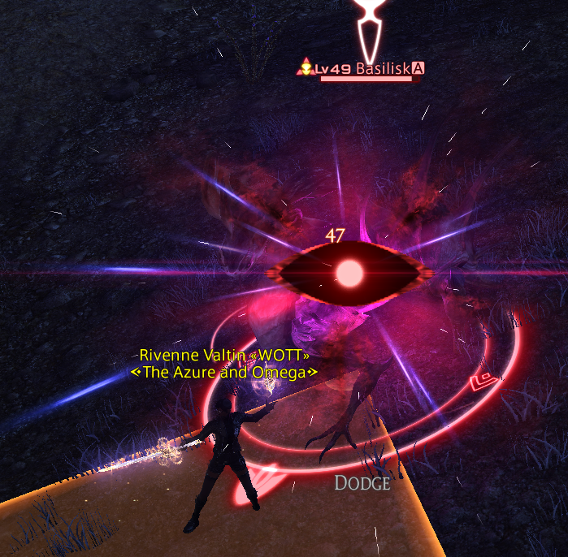

A list of various commonly-used telegraphs and what they mean, as well as common ways to handle them. Most have a common pattern of telegraphing (i.e. warning you about what's going to happen) then actually happening a few seconds later (can be called activating, going off, or resolving). 

There are a huge number of special-case telegraphs. While that might seem annoying, they usually works the same as another telegraph on this list and are just visually different. The more mechanics you've seen and understand the easier it will get to pick up on these, but the developers add new twists to new fights all the time to keep things interesting.

The fight mechanics in this game are meant to be mini-puzzles. Easy content will make these puzzles easy, but even in those cases you should expect that you'll fail to figure out the puzzle on your first try here and there, no matter how experienced you are. There's no shame in that. And if you're not experienced you'll probably fail them a lot while figuring them out.

### Acceleration Bombs

(Screenshot pending, appears as dice counting down over your head.)

When the dice hits 0, you cannot be moving, attack, or performing kind of animation or you will take damage. Typically it's best to stop and detarget the boss at 1, maybe even 2 if you have bad ping. There will be a final audio cue at the "0" mark, at which point you can move again.

### Chains

(Screenshot pending, appears as a chain of some kind connecting two people.)

Most instances of this mechanic require you to move away from the person you are chained to in order to force the chain to snap, and will deal damage for failing to do so. A notable exception is Ifrit. His chain (which he does not use on all difficulty modes) instead punishes you for being too far from each-other by reducing your damage dealt and making you take more damage, so be careful with him in particular.

Regardless of which chain mechanic type it is, you can be assured that if you are attached to another player via some kind of line, distance matters. Sometimes you need to move far apart (usually this), sometimes you need to be close together, and in rare instances the distance needs to be just right (both too far and too close punish you).

**Magnetic Chains**
Looks like a regular chain, but you also have a plus or minus symbol over your head. These two indicate magnetic polarity. If you have the same symbol, you will be pushed apart. If you have the opposite symbol, you will be pulled together. Usually the right answer is to start the opposite (start close if it pushes apart, start far apart if it pulls together.)

### Counting Towers

(Screenshot pending, appears as a circular area on the ground with multiple marks that light up one at a time for each person inside.)

Like towers, these are meant to be stood inside. Unlike towers, you need more than one person, and typically there is no damage if the right number of people are inside. You can tell the number needed by the marks within the circle itself. One should light up for each person inside. If all are lit up, enough people are inside.

One variation of this attack, which specifically uses dots, will show chains around the outside of the circle the moment enough people step inside. This means that circle is "locked". If you fail these ones than the boss will typically summon an additional enemy in that spot.

### Damage Down

(Screenshot pending)

This mark is almost always a punishment for failing to do a mechanic correctly. _These are extremely punishing_, typically being -50% damage for 30 seconds or more. Avoid at absolutely all costs! Even standing there doing nothing for 10s to avoid it is better than taking this hit.

Sometimes derogatorially called a Dumbage Down. There is at least one example of a forced damage down, however that particular one can be removed by a healer, so it's more of an esuna check.

### Gaze Attack

The eye symbol means that your character must be facing away from the monster when the attack activates or you will take some form of negative effect. They're usually something like paralysis, stun, petrify, or doom, and even in easier fights can easily kill you from the single mistake.

Remember, it is your _character_ that must face away, not your camera. Your character has a vision cone of approximately 90 degrees, maybe a touch more. The cone in the image is also 90 degrees to give you an example of what it looks like.

If a gaze attack also has an orange marker on the ground, that means you can avoid it either by turning away _or_ by being out of the orange marker. It is not necessary to do both. Other telegraphs combined with gaze attacks are just two separate effects happening at once, so in those cases you'll have to do both things (e.g. stack and look away).

### Knockback

There are several different knockback telegraphs, with the only thing in common being that they push you away from some set location. I won't cover any that only appear in one fight. Note that many of these can be negated with Arm's Length or Surecast, but not all of them. And you won't know which is which until you try. However, all of them can be counteracted by using a gap closer after the knockback pushes you out of the range of the boss.

**Tidal Wave**

Appears as a watery spout on the edge of the arena. When it goes off a few seconds later, everyone is pushed away from that side of the arena. Often requires you to be right up next to that edge to avoid being pushed completely off.

**Blue Circle**

Appears as a blue pulsing circle. When it goes off you are pushed directly away from the center of it. However, being _inside_ the circle when it resolves is also deadly.

**Ground Arrows**

Fairly self-explanatory. If you see arrows on the ground traveling in a specific direction, that is the direction you will be moved when the knockback activates.

**Punish Knockbacks**

Some knockbacks aren't telegraphed separately, but are instead punishments for failing another mechanic and are meant to kill you.

### Meteors

(Screenshot pending, appears as a rock with a vertical dashed line extending upwards to a slowly-falling meteor.)

These indicate that you must kill the rock before the meteor falling on that location finishes landing or you will take huge damage.

### Orbs

A slow-moving spherical projectile moving through the battlefield. Typically does very large damage if you touch it, sometimes in an area. Should be avoided. Note that due to network latency, you should treat the hitbox of the orb as being a little be in front of it (in the direction it's moving). It's much easier to be hit by these projectiles when standing in front of them than when sneaking in behind them.

### Orange Marker

(Screenshot pending, example visible in Gaze Attack section)

When a colored area appears on the ground, that means some form of attack will be hitting that area soon. Orange (and sometimes very light blue) markers indicate that if you are standing in that area when the color disappears you will be hit by an attack, so move. Some of these attacks will leave behind damaging areas as well, but if they do not then it is safe to move in as soon as the orange fully disappears, even if the attack animation is still going.

The area shown by the orange is _very_ precise. If the center of your character is even a tiny bit outside of the colored area, you're fine.

### Puddle

General term for any persistent ground-based effect that you don't want to walk through. Appearances vary wildly.

### Proximity Marker

(Screenshot pending, appears as a small orange circle with thin orange lines pulsing out from it.)

This marker means that you will take extra damage if you are too close to it. Most such markers do not smoothly fall off. There is simply a distance where you take "kills you" damage, and a distance where you're fine. Two people can be touching and one can die while the other takes almost nothing. If you don't know the exact distance it's probably best to play it safe, since this marker does not show you the precise distance you need to be.

**Flare Marker**

(Flare marker screenshot pending, appears like a triangle made of arrows that point outward from a person.)

This acts like a proximity marker, except that instead of being attached to the ground it's attached to a person. The person it's attached to is forced to take full damage, but they can move away to ensure that others take less. Usually multiple proximity markers appear, and/or they appear on tanks who can take the bigger hit.

### Stack Marker

(Screenshot pending, appears as a thin circle with 4 arrows pointing inward, usually centered on a person)

This marker means that the damage dealt by the attack will be split between everyone inside the circle. If it targets you then try to make it easy for people to get to you and don't move too much if you're already close to the boss. Some bosses have a multi-hit variation of this, in which case every hit is split separately and you need to remain stacked until it's over.

In rare cases a small version of the same telegraph appears to indicate you should stack in a spot, even if it isn't specifically dealing damage.

### Stillness/Motion

Unfortunately the markers for this one vary way too much. The simple version is as follows

**Stillness**: Much like acceleration bomb, just stop moving, attacking, or animating in any way. Detarget the boss to ensure you don't auto-attack. If there is any animation happening when it checks, you get punished. Possibly with instant death.

**Motion**: The opposite of stillness. When it checks, you _must_ be moving. Unlike stillness, though, usually only actual movement and jumping count. Casting, auto-attacks, etc usually do not count.

### Tethers

A general name for when a line of some kind connects any two entities on the battlefield. When it's two players connected, that's typically called a chain instead. Unless it's a positive effect the player themselves triggers (e.g. Dragoon with Dragon Sight or Paladin with Cover), then it's called a tether again.

If two enemies tether to each-other that's usually a sign they need to be pulled apart to prevent them from buffing each-other. When pulled apart the line should disappear to indicate that they are no longer buffed.

If an enemy tethers to a player, it means it will use some kind of special move on that target unless it is somehow intercepted. These can work in a few ways:
* Handoff - If someone passes between the player and enemy, the tether will redirect to consider them its new primary target and start following them around. 
* Interception - If a person passes between the player and enemy, the tether will _appear_ to redirect to them, but it will not follow the new target and if that person gets out of the way it will go back to the original target. These ones require the interceptor to stay between the original target and the enemy if they wish to absorb the effect.
* Special - Some fights just follow their own rules for deciding who gets tethered. Usually in these cases you either need to do something fight-specific to change the target, or you just can't change the target.

### Towers

(Screenshot pending, appears as a white-ish circle, often with a verticle element sticking out of it the center, hence the name "tower". Can also have an orb or rock falling into the middle slowly.)

These markers mean that there must be someone in the area when the attack goes off to take the hit for the team. They will take a small amount of damage, but if no-one stand in the marked area then _everyone_ will take a _lot_ of damage.

### Vuln/Vuln Stack

(Screenshot pending)

A generic debuff called "Vulnerability" that is applied when you mess up certain mechanics. If you get hit with another vulnerability before the first one wears off the duration will reset and the effect will stack, potentially leading to taking dramatically increased quantities of damage.